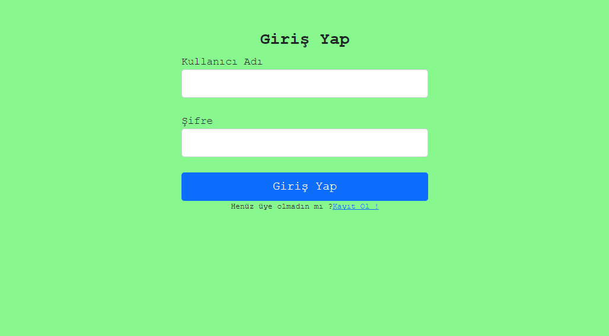
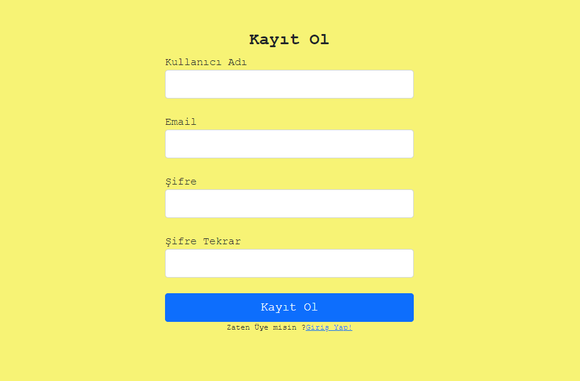
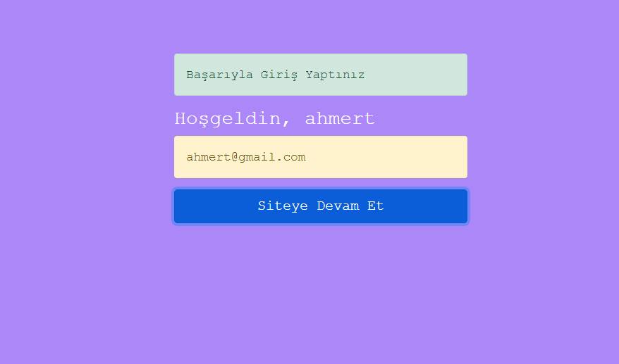
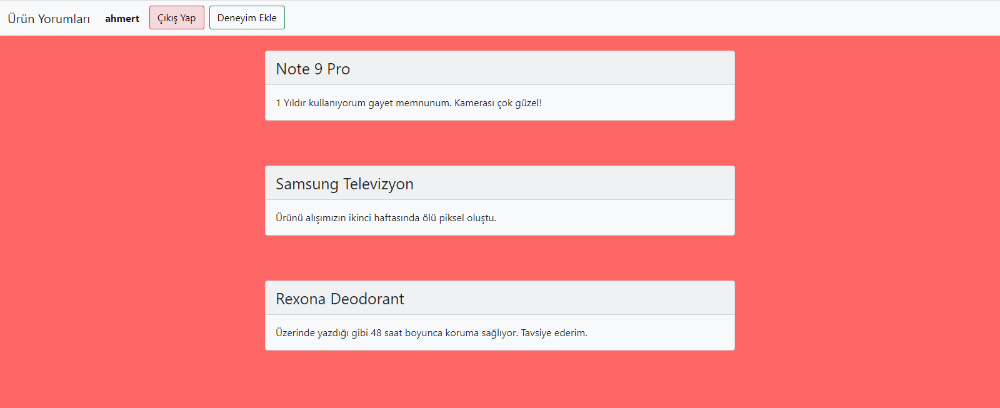

# 🤔 Kullanıcı Deneyimleri 💭

<b>Kullanıcı Deneyimleri, çevirimiçi bir deneyim paylaşma sitesidir.</b>

Siteye buradan ulaşabilirsiniz. 👉 [Site Linki](http://kullanicideneyimleri.coolpage.biz/login.php) 👈

## Sitenin Amacı
Siteye kayıt olup, giriş yapan kullanıcının daha önceden kullandığı veya kullanmakta olduğu bir ürün hakkında deneyim paylaşabilmesi,
paylaştığı deneyimi düzenleyebilmesi ve isterse paylaştığı deneyimi veritabanından silebilmesi. Ayrıca siteye üye diğer kullanıcıların
paylaştığı deneyimleri görebilmesidir.

## Siteye nasıl girilir?
Siteye yukarıda iki emoji arası verilen linkten ya da http://kullanicideneyimleri.coolpage.biz/login.php adresinden girebilirsiniz.

# Site içi Görüntüler
Kullanıcının giriş yapacağı sayfa &emsp;&emsp;&emsp;&emsp;&emsp;&emsp;&emsp;&emsp;&emsp;&emsp;&emsp;&emsp;&emsp;&emsp;&emsp;&emsp;    Kullanıcının kayıt olacağı sayfa 
   

Kullanıcının girişini gösteren sayfa &emsp;&emsp;&emsp;&emsp;&emsp;&emsp;&emsp;&emsp;&emsp;&emsp;&emsp;&emsp;&emsp;&emsp;&emsp;&emsp;    Kullanıcının  anasayfası 
   

 
# 💻 Teknolojiler 
- HTML 
- JavaScript 
- CSS

# 🎨 Tasarım 
Oyunda yer alan resimlerin kimini birkaç resimin oluşmasından kendim tasarladım kimini direkt olarak png olarak koydum.

Tasarımlarım: Arka plan resmi, bitki evreleri ve asit damlası.

Tasarım platformu olarak [canva.com](https://www.canva.com/) 'u tercih ettim.

# 🔊 Ses Efektleri ve Müzik 
Oyundaki yer alan sesler [mixkit.co](https://mixkit.co/) sitesinden ve youtubeden alınmıştır.

# 📞 Lisans ve İletişim
Oyun hikayesi tasarımı, nesne tasarımları ve kodlar  [@ahmetmert1](https://github.com/ahmetmert1) tarafından yapılmıştır. 

[Linkedin](https://www.linkedin.com/in/ahmet-mert-öz)

[E-posta](ahmetmertoz11@gmail.com)
