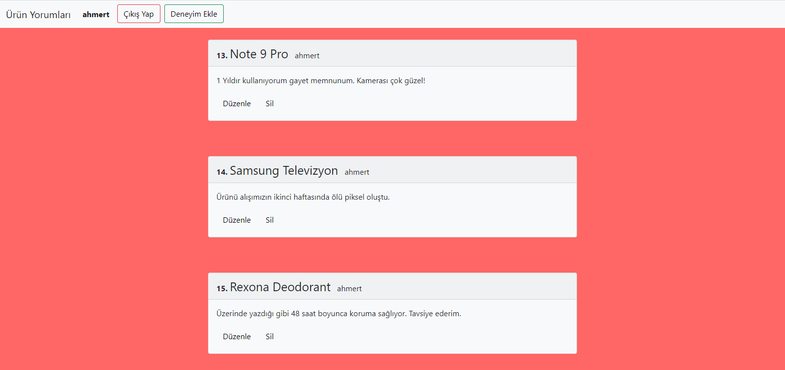
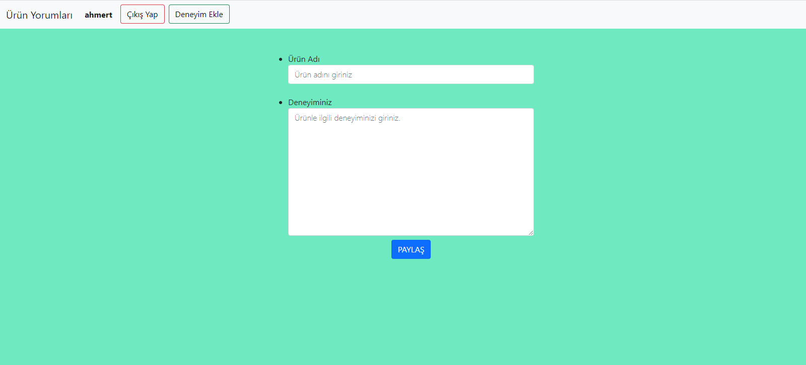
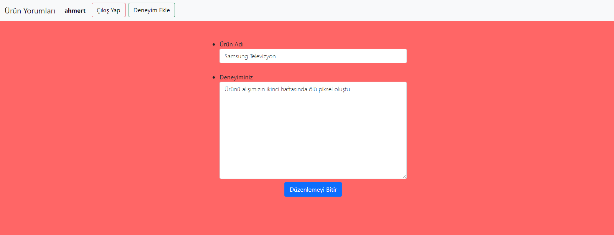

# 🤔 Kullanıcı Deneyimleri 💭

<b>Kullanıcı Deneyimleri, çevirimiçi bir deneyim paylaşma sitesidir.</b>

Siteye buradan ulaşabilirsiniz. 👉 [Site Linki](http://kullanicideneyimleri.coolpage.biz/login.php) 👈

## Sitenin Amacı
Siteye kayıt olup, giriş yapan kullanıcının daha önceden kullandığı veya kullanmakta olduğu bir ürün hakkında deneyim paylaşabilmesi,
paylaştığı deneyimi düzenleyebilmesi ve isterse paylaştığı deneyimi veritabanından silebilmesi. Ayrıca siteye üye diğer kullanıcıların
paylaştığı deneyimleri görebilmesidir.

## Siteye nasıl girilir?
Siteye yukarıda iki emoji arası verilen linkten ya da http://kullanicideneyimleri.coolpage.biz/login.php adresinden girebilirsiniz.

# Site içi Görüntüler
Kullanıcının giriş yapacağı sayfa &emsp;&emsp;&emsp;&emsp;&emsp;&emsp;&emsp;&emsp;&emsp;&emsp;&emsp;&emsp;&emsp;&emsp;&emsp;&emsp;    Kullanıcının kayıt olacağı sayfa 
   

Kullanıcının girişini gösteren sayfa &emsp;&emsp;&emsp;&emsp;&emsp;&emsp;&emsp;&emsp;&emsp;&emsp;&emsp;&emsp;&emsp;&emsp;&emsp;&emsp;    Kullanıcının  anasayfası 
   

Kullanıcının kendi deneyimlerinin olduğu sayfa &emsp;&emsp;&emsp;&emsp;&emsp;&emsp;&emsp;&emsp;&emsp;&emsp;&emsp;&emsp;&emsp;&emsp;&emsp;&emsp;    Kullanıcının deneyim ekleyeceği sayfa 
   

Kullanıcının deneyimini düzenleyeceği sayfa &emsp;&emsp;&emsp;&emsp;&emsp;&emsp;&emsp;&emsp;&emsp;&emsp;&emsp;&emsp;&emsp;&emsp;&emsp;&emsp;     
   

 
# 💻 Teknolojiler 
- HTML 
- JavaScript 
- CSS
- PHP
- SQL

# 📞 Lisans ve İletişim

[Linkedin](https://www.linkedin.com/in/ahmet-mert-öz)

[E-posta](ahmetmertoz11@gmail.com)
